# 🍽️ Hungry To Eat (Express.js + EJS + MongoDB + Cloudinary)

This project, developed for the **Somnium Hackathon**, serves as both an **Admin and Customer Panel** for seamless **food menu management**. It allows restaurant admins to **upload food images to Cloudinary**, store menu details in **MongoDB**, and efficiently manage **menu updates, orders, and customer interactions**. Customers can explore the **food menu**, add items to their **cart**, leave **ratings**, and apply **filters** to find their desired dishes easily.

## 🚀 Features

✅ **Upload food images to Cloudinary** using `multer-storage-cloudinary`  
✅ **Store food details** (`name`, `price`, `rating`, `calories`, etc.) in MongoDB  
✅ **Admin panel** for adding food items (built with EJS for templating)  
✅ **Secure authentication system** for admins  
✅ **Tech stack:** `Express.js`, `Mongoose`, `EJS`, `Multer`, `Cookie-Parser`  

---

## 🛠️ Installation & Setup

### 1️⃣ Clone the Repository
```sh
git clone <your-repo-url>
cd <your-project-folder>
```

### 2️⃣ Install Dependencies
```sh
npm install
```

### 3️⃣ Set Up Environment Variables
Create a `.env` file inside the project and add your credentials:
```env
PORT=3000
MONGO_URI=mongodb+srv://<your-mongodb-connection-string>
CLOUD_NAME=<your-cloudinary-cloud-name>
CLOUD_API_KEY=<your-cloudinary-api-key>
CLOUD_API_SECRET=<your-cloudinary-api-secret>
```

---

## ▶️ Running the Project
Start the development server:
```sh
npm run dev
```
Your app should now be running at:  
🔗 **http://localhost:3000**

---

## 📂 Project Structure
```
📁 your-project-folder
 ├── 📂 config
 │   └── 📝 cloudinary.js       # Cloudinary configuration
 ├── 📂 views
 │   └── 📝 admin_addFood.ejs    # EJS template for adding food items
 ├── 📂 models
 │   └── 📝 menu.js             # Mongoose schema for food menu
 ├── 📝 .env                    # Environment variables (DO NOT SHARE)
 ├── 📝 server.js               # Main Express server file
 ├── 📝 package.json            # Project dependencies
 ├── 📝 README.md               # Project documentation (this file)
```

---

## 📸 Screenshots

### 🏠 Home Page  
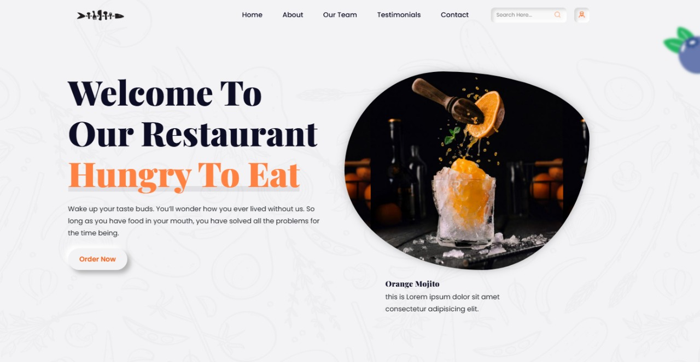  
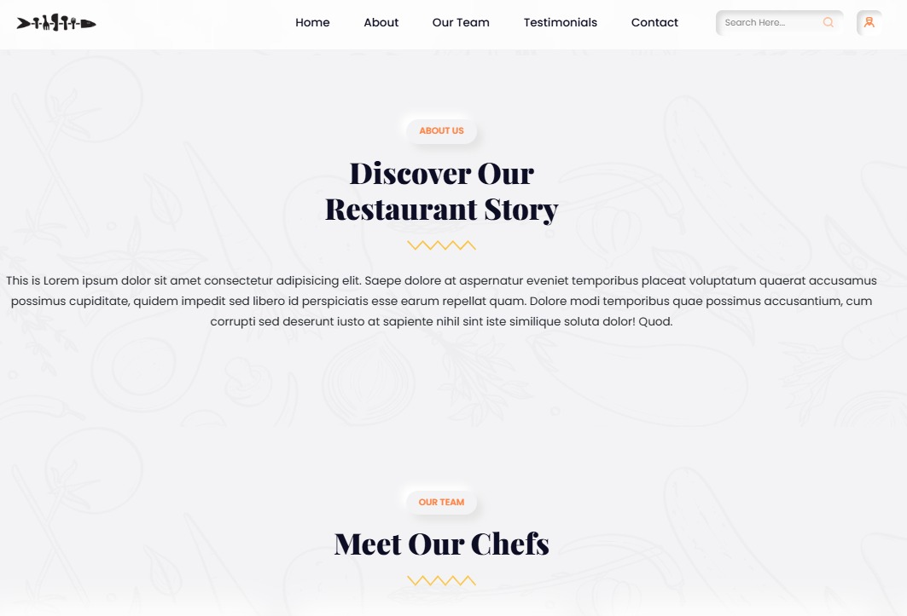  
  
  
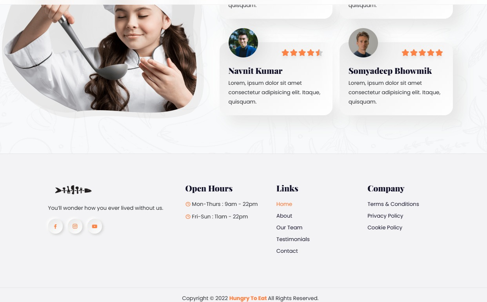  

### 🔐 Sign In  
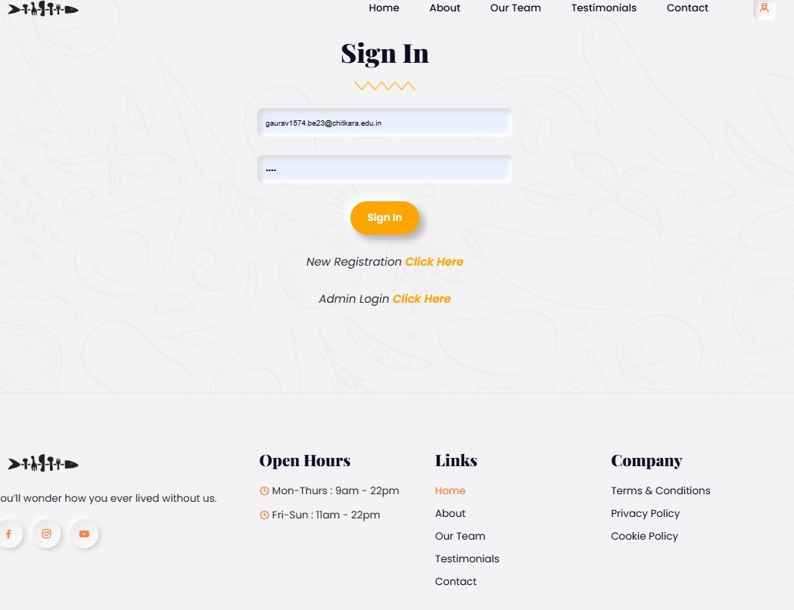  
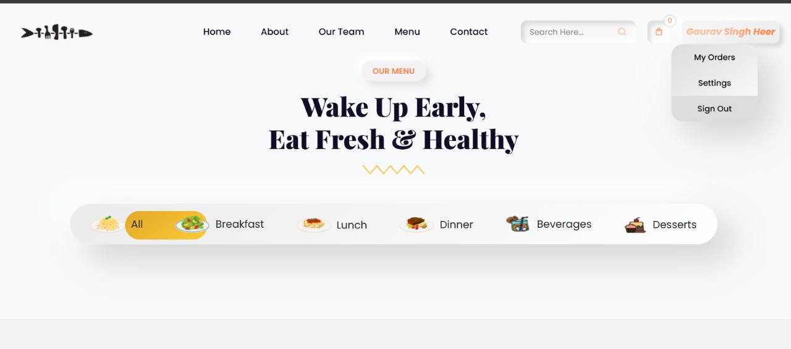  

### ⚙️ Admin Panel  
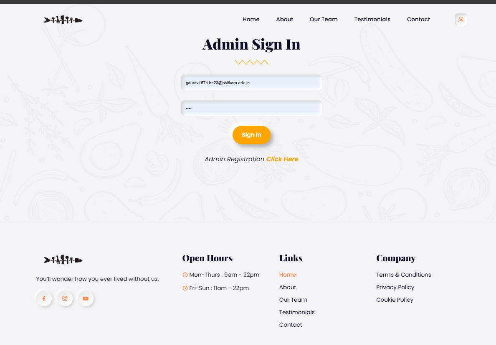  
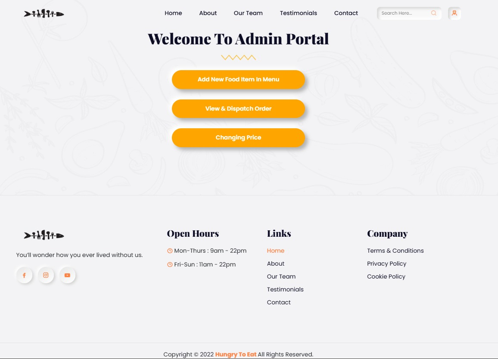  
  
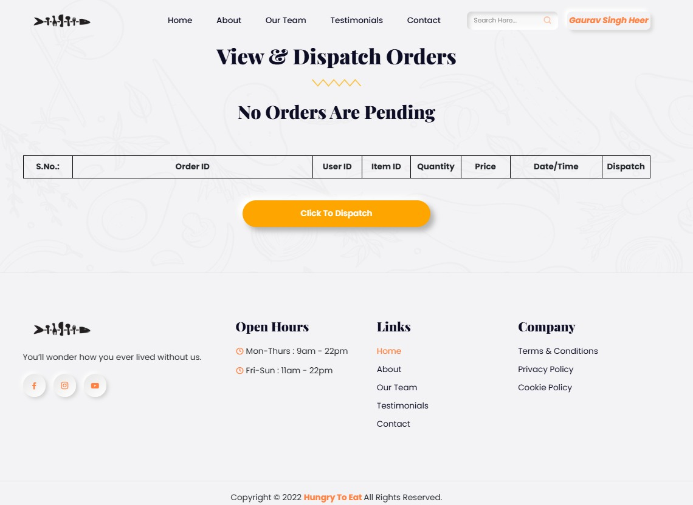  

### ➕ Adding an Item to the Menu (Example: Dessert Filter)  
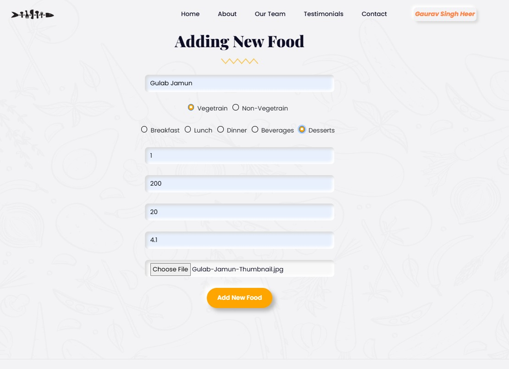  

### 👤 User Sign In  
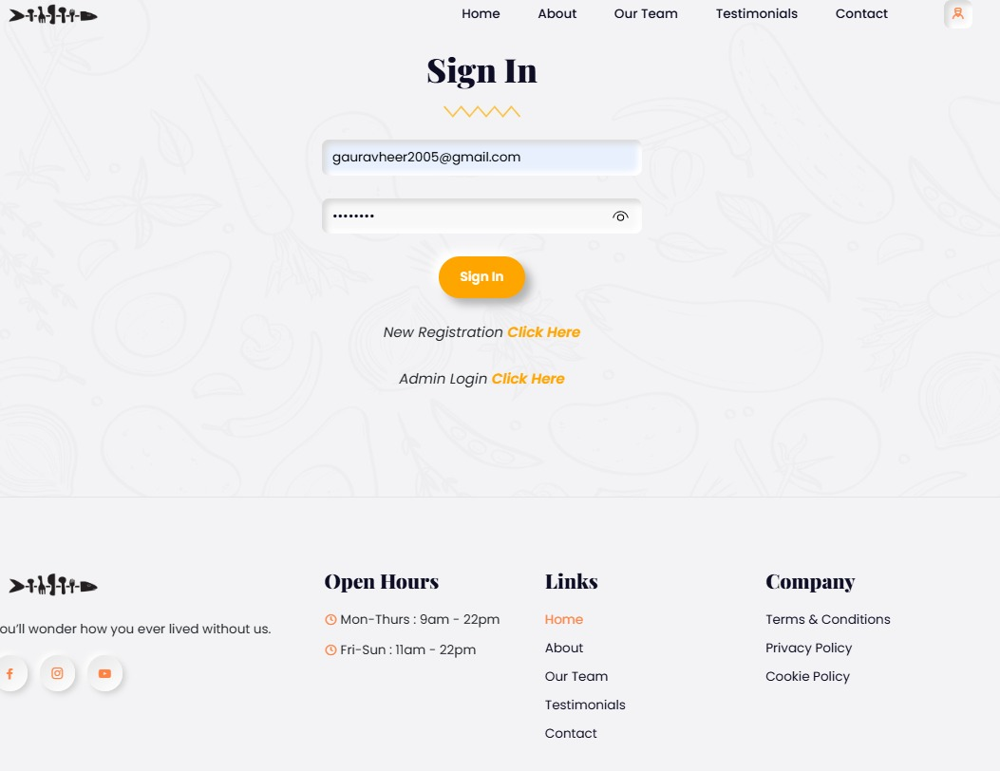  

### 🍕 Image Shown in Menu  
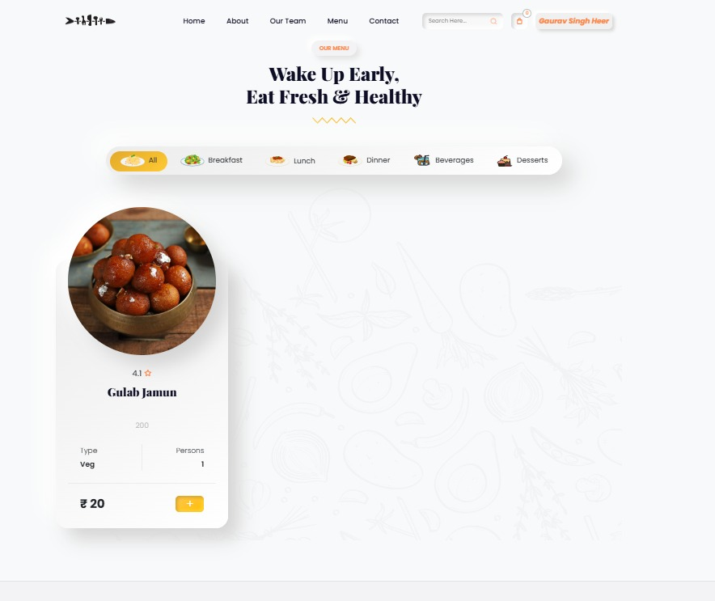  
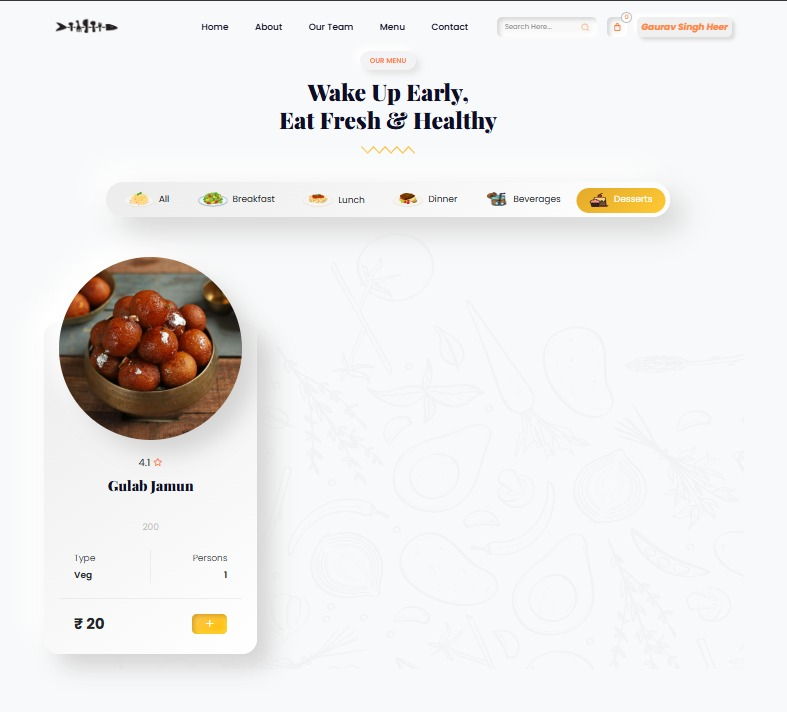  

### 📌 Other Added Items in the Menu  
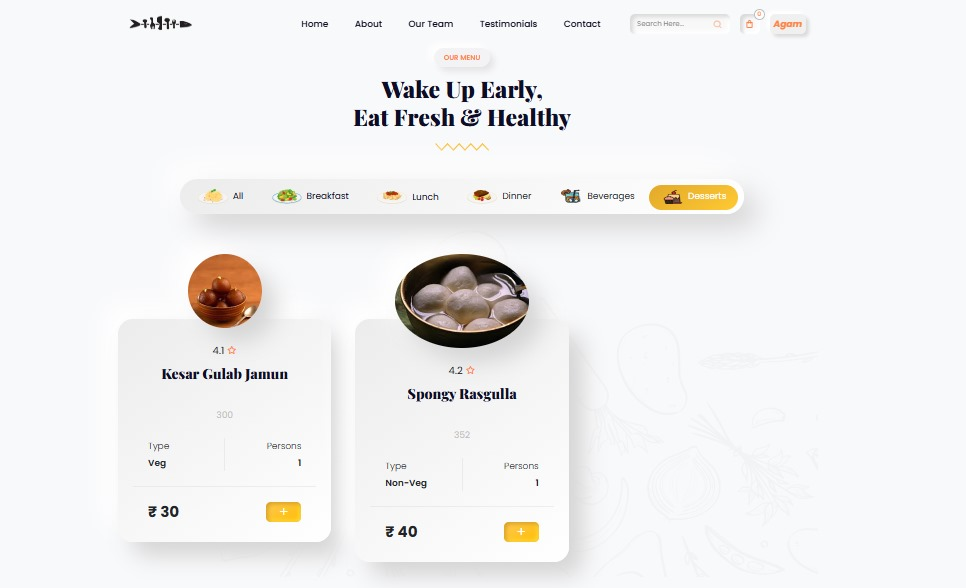  
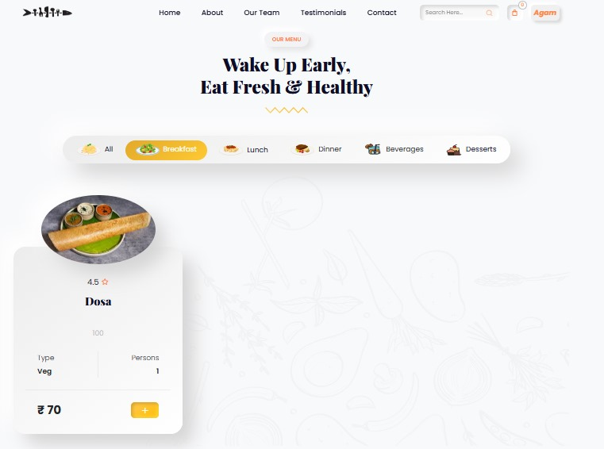  
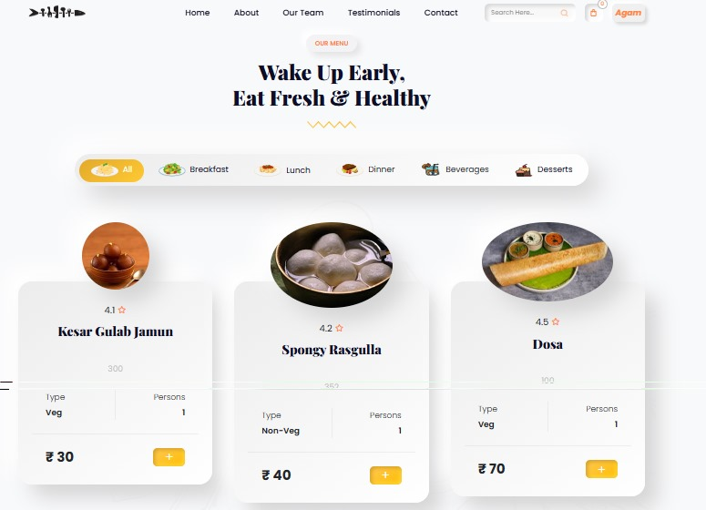  

---

## ❌ Troubleshooting

### 🔹 **Cloudinary Not Working on Deployment?**
If Cloudinary is **not uploading images in production**, check the following:
1. Ensure your **Cloudinary credentials** (`CLOUD_NAME`, `CLOUD_API_KEY`, `CLOUD_API_SECRET`) are **correct** in the `.env` file.
2. Make sure your **multer-storage-cloudinary** package is correctly configured in `cloudinary.js`.
3. **Verify deployment logs** to check for missing environment variables.
4. **Try adding explicit options** in `cloudinary.config()`:
   ```js
   cloudinary.config({
       cloud_name: process.env.CLOUD_NAME,
       api_key: process.env.CLOUD_API_KEY,
       api_secret: process.env.CLOUD_API_SECRET,
       secure: true
   });
   ```
5. If using **Render or Vercel**, ensure **environment variables are set in the dashboard**.

---

## 📜 License
This project is licensed under the **MIT License**.
